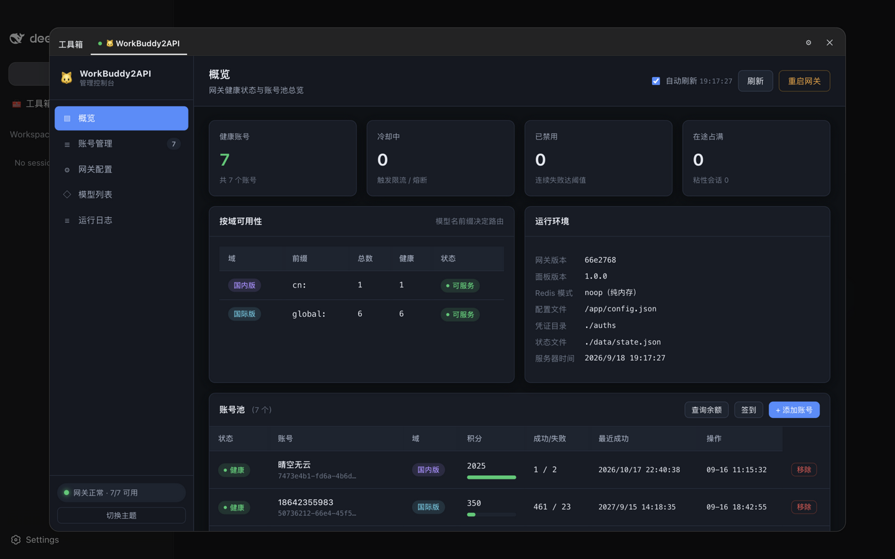
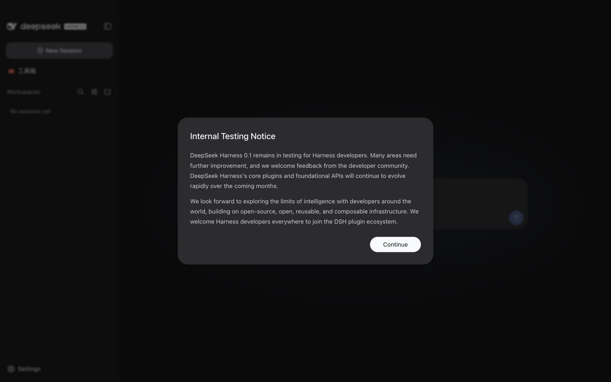

# dsh-toolbox · 工具箱

给 [DSH Desktop](https://github.com/dataelement/dsh-desktop)（DeepSeek Harness 桌面端）加一个**工具箱**：左栏一个入口，点开后是一个带 Tab 的面板，每个 Tab 内嵌一个你本机跑着的工具页面。

第一个内置 Tab 是 [WorkBuddy2API](https://github.com/Sliverkiss/workbuddy2api) 的管理面板（`http://127.0.0.1:7863/panel/`），其余的可以自己加。



左栏入口（在「新会话」与「工作区」之间）：



## 它做什么

- **左栏入口**：出现在「MCP 连接器」下方、「工作区」上方，与官方导航项同一套样式。
- **Tab 容器**：每个 Tab 是一个内嵌页面（iframe），指向你配置的地址。
- **可配置**：面板右上角 ⚙ 打开设置，增删改 Tab，保存后写入 `$DSH_HOME/toolbox/config.json`。
- **连通性提示**：打开面板时会探测各 Tab 是否可达，不可达时给出原因和地址，而不是一片空白。

## 安装

需要本机已装 DSH Desktop（Harness ≥ `0.1.2-alpha.1`）。

```bash
HARNESS_HOME="$HOME/Library/Application Support/dsh-desktop/harness"
APP="/Applications/DSH Desktop.app/Contents/Resources/app"

# 1) 把 Desktop 自带的 pnpm / node shim 放进 PATH（插件安装靠 pnpm）
export DSH_HOME="$HARNESS_HOME"
export PATH="$HARNESS_HOME/.desktop-bin:$PATH"

# 2) 以本地链接方式装进 web profile
cd "$HARNESS_HOME/profiles/web"
"$HARNESS_HOME/.desktop-bin/node" \
  "$APP/node_modules/@deepseek-ai/dsh/lib/bin.js" \
  plugin --profile web add "link:/path/to/dsh-toolbox"
```

把最后的 `link:/path/to/dsh-toolbox` 换成本仓库的实际路径。

装完**完全退出 DSH Desktop 再重新打开**（是退出进程，不是关窗口），左栏就会出现「工具箱」。

> **Windows**：`$DSH_HOME` 是 `%APPDATA%\dsh-desktop\harness`，Harness 入口换成
> `…\DSH Desktop\resources\app\node_modules\@deepseek-ai\dsh\lib\bin.js`，
> shim 目录是 `%APPDATA%\dsh-desktop\harness\.desktop-bin`。

### 卸载

```bash
# 同样的环境变量设置下
cd "$HARNESS_HOME/profiles/web"
"$HARNESS_HOME/.desktop-bin/node" \
  "$APP/node_modules/@deepseek-ai/dsh/lib/bin.js" \
  plugin --profile web remove dsh-toolbox
```

配置不会随卸载删除，仍留在 `$DSH_HOME/toolbox/config.json`，需要时手动删。

## 配置

面板右上角 **⚙** 进入设置：

| 字段 | 说明 |
| --- | --- |
| 图标 | 显示在 Tab 上的 emoji，可留空 |
| 名称 | Tab 标题 |
| 地址 | 要内嵌的页面地址，必须是 `http://` 或 `https://` |
| 启用 | 取消勾选即隐藏该 Tab，不删除配置 |

配置持久化在 `$DSH_HOME/toolbox/config.json`。它和 Harness 的其它用户数据同级，**覆盖安装或升级 DSH Desktop 不会影响它**。

示例配置：

```json
{
  "tabs": [
    {
      "id": "workbuddy2api",
      "label": "WorkBuddy2API",
      "icon": "🐱",
      "url": "http://127.0.0.1:7863/panel/#overview",
      "enabled": true
    },
    {
      "id": "grafana",
      "label": "监控",
      "icon": "📈",
      "url": "http://127.0.0.1:3000/",
      "enabled": true
    }
  ]
}
```

改完文件后重新打开面板即可生效。

## 内嵌页面的前提

被嵌入的页面必须**允许被 iframe 引用**。如果目标服务返回了 `X-Frame-Options: DENY/SAMEORIGIN`
或 CSP 里的 `frame-ancestors`，浏览器会拒绝渲染，面板会显示空白（此时 Tab 的连通性探测仍是绿的，
因为服务本身可达）。

本机服务通常没这些限制。WorkBuddy2API 面板实测可直接嵌入。

如果某个工具不允许嵌入，可行的做法是给它加一个允许 `frame-ancestors` 的反向代理，或改用其它方式
（例如把该工具的输出做成一个静态页面）。

## 安全边界

- 配置接口只接受**回环请求**（socket 来自 `127.0.0.1`/`::1`，且 Host 头指向回环，且非跨站发起）。
  Harness 可能通过隧道暴露到外网，仅靠端口绑定不足以拦住经隧道的访问。
- 连通性探测**只探测回环地址**，不会变成扫描内网/外网的探针。
- 写配置走「临时文件 + rename」的原子写，中途退出不会留下半份 JSON。

## 结构

```
lib/index.js    宿主半区：/toolbox/config 读写、/toolbox/probe 连通性探测
lib/client.js   客户端半区：左栏入口 + Tab 面板
cordis.patch.yml  作为 bundle 合入 profile 时插入插件行
```

插件只依赖宿主已提供的 `react` / `react-dom` / `@deepseek-ai/*`，没有任何运行时依赖，
因此不需要构建步骤，`lib/*.js` 就是产物。

## 开发

```bash
npm run check   # 语法检查
```

改完代码后重启 DSH Desktop 即可看到效果（客户端半区不带热更新）。

## 许可

MIT
